# Supply Chain Analytics Platform — "CanRoute"
### Power BI Dashboard · Insights · Business Problems · Recommendations (2020–2025)

> Built by **Rashad Alaa**
> "CanRoute" is a fictional brand name, and all underlying data in this project is synthetic — generated by the author (see [`data/script/generate_logistics_data.py`](data/script/generate_logistics_data.py)) to simulate a Canadian B2B last-mile delivery marketplace. No real company, retailer, or transaction data is used.

🔗 **[Power BI Dashboard File](power_bi/dashboard.pbix)**
📄 **[Project Overview PDF](docs/reports/project_overview.pdf)** · **[Full Report PDF](docs/reports/full_analytical_report.pdf)**

📊 **[Dashboard Insights](docs/reports/dashboard_insights.md)** · 🚩 **[Business Problems](docs/reports/business_problems.md)** · ✅ **[Business Recommendations](docs/reports/business_recommendations.md)**

A 4-page Power BI dashboard, built on a SQL star-schema data warehouse, analyzing GMV-to-revenue leakage, delivery performance, retailer concentration, and financial health for a Canadian B2B last-mile delivery business. This document walks through each dashboard page: the key insight, the business problem it points to, and the recommendation that follows.

---

## 1. Executive Overview

**Key Insights**

- Realized Revenue stands at **$77M** against a **Total GMV of $111.66M** — roughly 31% of gross order value never converts to realized revenue.


- The **Mismatch Rate is 16.55%**, while the **Collection Rate is 69.31%** — these two figures move together, indicating a large share of the revenue gap is tied to order/payment/delivery status inconsistencies rather than pure non-payment.
- Realized Revenue grew consistently year over year: $8.6M (2020) → $10.6M (2021) → $12.9M (2022) → $13.6M (2023) → $15.5M (2024) → $16.0M (2025). Growth visibly decelerates after 2022.

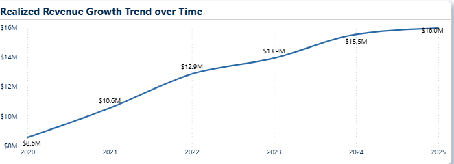

- Revenue is heavily geographically concentrated: **Central Canada = $52M (68%)**, **Western Canada = $23M (30%)**, **Atlantic Canada = only $2M (2%)**.

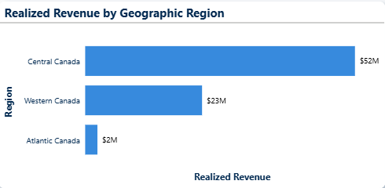

- Product category revenue is led by **Food & Beverage ($41M, 46%)**, followed by **Industrial & Packaging ($30M, 33%)** and **Household & Cleaning ($19M, 21%)**.

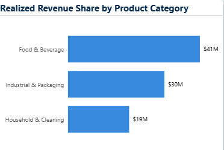

- Payment behavior is split between **Electronic Payment (64.6%)** and **Credit Terms (31.6%)**, with **Cash at only 3.8%**.

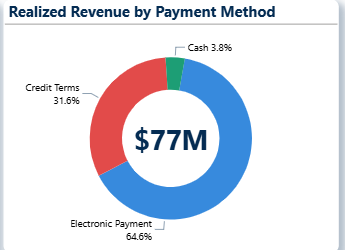

- Supplier revenue follows a Pareto pattern: **47 "Core" (A) suppliers generate 69.47%**, 26 "Mid" (B) suppliers generate 24.76%, and 7 "Long-tail" (C) suppliers generate only 5.77%.

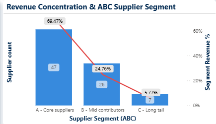

---

## 2. Logistics & Delivery Operations

**Key Insights**

- The **Delay Rate is 63.62%** — nearly two-thirds of all orders experience some form of delay relative to their expected delivery window.


- Order distribution by delay status is **bimodal**: Early = 26.5K, **Severe Delay (12–72h) = 21.3K** (second-largest bucket), Moderate = 12.3K, Minor = 8.9K, Major = 5.2K, Pending = 4.0K, Extreme = 2.5K.

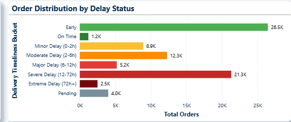

- On-Time Rate % shows a strong seasonal pattern: performance sits near **20% in Jan–Mar**, then rises sharply to a stable **~40% plateau** from Apr through Nov.

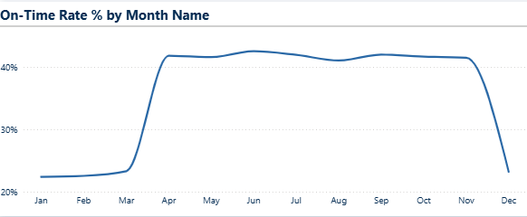

- Cash at Risk % by province ranges from **2.35% (NS) to 4.28% (MB)**.

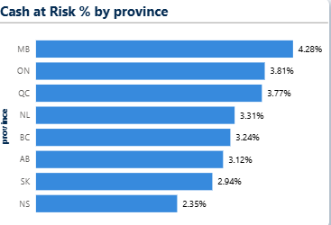

- Weather impact: on-time performance is nearly identical between cold and non-cold cities (47.54% vs 46.97%), but a **secondary delivery outcome diverges sharply** (40.99% vs 19.51%).

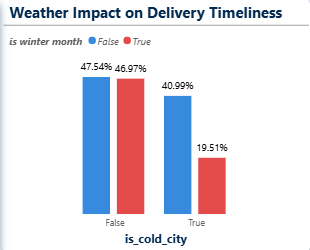

- Cross-status anomalies by severity: **Critical = 6.4K**, High = 4.1K, Medium = 3.0K.

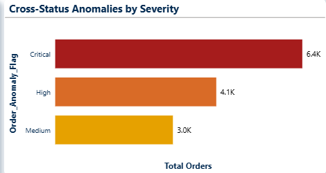

- Of 82K total orders, only 67K (~82%) show as "Delivered"; Failure (2.91%) + Cancellation (4.88%) account for under 8%, leaving **~10% of orders in an unclassified state**.

**Business Problems**

- Majority of orders are delayed — 63.62% Delay Rate.
- Severe Delay is a major volume bucket, not an edge case (21.3K orders).
- Seasonal collapse in on-time performance every Jan–Mar.
- High-severity anomalies dominate (6.4K Critical > 3.0K Medium).
- ~10% of orders sit in an ambiguous, unclassified delivery state.
- Provincial cash-at-risk spread of nearly 2 points (2.35%–4.28%).
- Winter conditions materially affect a specific delivery outcome even where the headline on-time metric appears stable.

**Recommendations**

- Review the Jan–Mar on-time collapse ahead of each Q1 and align staffing/carrier capacity/route planning to the seasonal pattern.
- Treat Severe Delay orders as a distinct operational tier with a dedicated tracking/escalation path.
- Tighten the operational status taxonomy to resolve the ambiguous ~10% of orders.
- Route Critical-severity anomalies (6.4K) to a fast-track review queue.
- Benchmark high cash-at-risk provinces (MB, ON, QC) against low ones (NS, AB, SK) and apply learnings where feasible.
- Track the diverging winter-specific delivery outcome separately rather than relying on the on-time rate alone.

---

## 3. Retailer Performance

**Key Insights**

- Of **489 Active Retailers**, AOV is **$1.36K** and Order Frequency is **116.86**, producing an **ARPR of $159K**.


- **Revenue Concentration (Top 20%) = 76.27%** — the top fifth of retailers generate more than three-quarters of total revenue.
- Active Retailer Growth (YoY) was volatile early on, with **2022 the only contraction year (-1.83%)**, before accelerating to +6.87% in 2025.

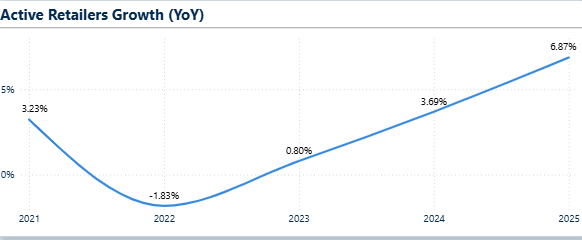

- RFM Segmentation concentrates retailers at the healthy end: **Champions = 29K, Loyal = 28K, Potential Loyalists = 15K**, versus much smaller At Risk (4K), New (3K), and Hibernating (1K) segments.

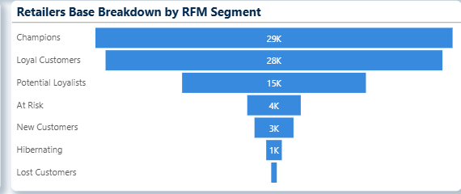

- Pareto Analysis: **Champions alone contribute 46.65%** of realized revenue, reaching **92.50% cumulative by Potential Loyalists**.

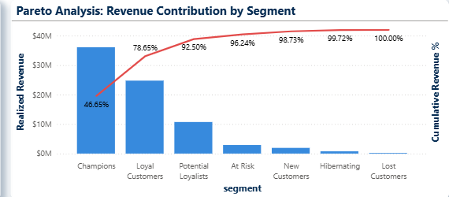

- The 2019 cohort's retention declined from **86.46% (month 1) to 72.92% (month 6)** — a clear early erosion pattern.

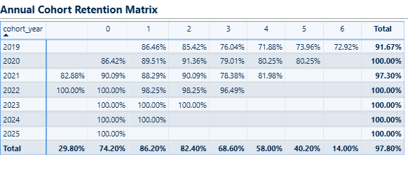

**Business Problems**

- Extreme revenue concentration: top 20% of retailers generate 76.27% of revenue.
- RFM segment concentration: top 3 segments = 92.5% of revenue.
- Supplier concentration: 47 "Core" suppliers generate 69.47% of supplier revenue.


- Geographic concentration: Central Canada = 68% of revenue vs Atlantic = 2%.


- Negative retailer growth in 2022 (-1.83%), the only contraction year.
- Cohort retention decay: 2019 cohort dropped from 86% to 73% within 6 months.
- 4K retailers "At Risk" and 1K "Hibernating" — meaningful attrition risk.

**Recommendations**

- Build a formal retention program targeting the At Risk (4K) and Hibernating (1K) segments before they convert to Lost.
- Build a structured key-account program for the top 20% of retailers, alongside growing Potential Loyalists into Loyal/Champion status.
- Diversify supplier dependency by developing part of the "Mid" (B) segment toward "Core" (A) status.
- Evaluate growth initiatives in Atlantic and Western Canada (combined 32% share vs Central's 68%).
- Investigate the causes of the 2022 negative growth to prevent recurrence.
- Use the 2019 cohort's decay curve as an early-warning benchmark for newer cohorts.

---

## 4. Financial Health

**Key Insights**

- **Cash Collected = $83.74M** against **Outstanding Receivables of $8.66M** and **Anomaly Cash Exposure of $18.81M** — more than double the outstanding receivables.


- Cash at Risk % = 3.61%, closely aligned with the province-level range seen on the Logistics page.
- The Cash Reconciliation & Revenue Leakage Waterfall starts at Cash Collected ($83.74M), adds Cash Pending (+$16.68M), then subtracts Cash at Risk, Failed Delivery Exposure, and Cash Lost/Reversed — **$11.25M in combined leakage** — arriving at $89.17M.

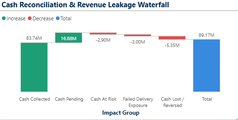

- GMV & Order Distribution by Operational Status: **Fulfilled = $91.15M / 66,628 orders**, Delivery Exception = $14.13M / 10,438 orders, Cancelled = $5.35M / 3,995 orders, In Progress = $1.03M / 776 orders.

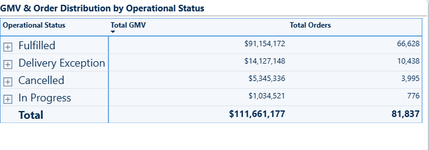

- Monthly Cash Inflow vs. Pending Closure rises gradually Jan–Oct, then accelerates sharply in Nov–Dec.

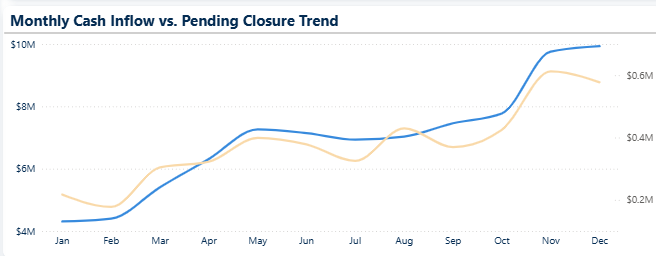

- AR Aging: **0–30 days = 47K** (dominant), 31–60 days = 9K, 60+ days = 5K, and **Not Paid = 21K** — larger than the 31–60 and 60+ buckets combined.

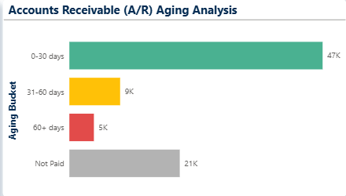

**Business Problems**

- Gross-to-realized revenue gap: $34.66M of GMV never converts to realized revenue.


- Low Collection Rate (69.31%) and High Mismatch Rate (16.55%).
- Anomaly Cash Exposure ($18.81M) exceeds Outstanding Receivables ($8.66M) by more than double.
- $11.25M lost across the cash reconciliation waterfall before revenue is realized.
- Large "Not Paid" AR bucket (21K invoices) outweighs the 31–60 and 60+ day buckets combined.
- $2.49M in "Wasted Delivery Effort" — cost incurred without corresponding realized value.

**Recommendations**

- Automate order/delivery/payment status validation at the point of status change to catch mismatches before reconciliation.
- Prioritize root-cause analysis on Anomaly Cash Exposure as a separate, higher-priority workstream from standard AR collections.
- Set a formal SLA for "Not Paid" invoices (escalate to collections/write-off review after a fixed number of days).
- Establish a monthly reconciliation checkpoint tracking the GMV → Cash Collected → Realized Revenue waterfall as one KPI chain.
- Investigate the drivers behind "Wasted Delivery Effort" ($2.49M).

---

## 5. Cross-Cutting Structural View

*Observations, problems, and recommendations that span more than one dashboard page.*

**Cross-Dashboard Observations**

- The $111.66M GMV → $89.17M reconciled cash → $83.74M cash collected → $77M realized revenue figures form a consistent waterfall across all four pages.
- The 16.55% Mismatch Rate is numerically close to the share of orders in Delivery Exception + Cancelled + In Progress status (~18.6%).
- Delay Rate (63.62%) is ~17x higher than Cash at Risk (3.61%) — delay is common but doesn't proportionally translate into financial risk.
- Revenue concentration appears at every structural level simultaneously: geographic (68%), retailer (76.27%), RFM segment (92.5%), and supplier (69.47%).

**Business Problems**

- Compounding leakage across the value chain, from GMV to realized revenue.
- Operational status problems and financial mismatch problems trace back to the same order population.
- Concentration risk is systemic — present across geography, retailers, RFM segments, and suppliers at once.

**Recommendations**

- Establish a single cross-functional KPI dashboard view tracking the GMV-to-revenue waterfall, delay rates, and concentration metrics together (this Power BI build is a first step).
- Route financial reconciliation review and operational status review through the same team, since the Mismatch Rate tracks non-Fulfilled order status.
- Treat diversification as a portfolio-level objective — set explicit concentration thresholds and monitor them alongside growth KPIs.

---

## Data Model

The dashboard is powered by a SQL galaxy schema (fact constellation) — **two fact tables sharing six dimensions** — not a flat file. This is what lets the RFM segmentation, cohort retention, and ABC supplier analysis run as native DAX measures instead of pre-computed columns.

> **Design note:** the model originally had four candidate fact tables — order, payment, delivery, and order details. Order, payment, and delivery all shared the same grain (one row per order), so they were consolidated into a single `fact_orders` table instead of being kept as three separate facts, avoiding an unnecessary fan-out at query time. `fact_order_details` was kept separate since it sits at a different, lower grain (one row per order line).

📄 [Data Dictionary](docs/data-model/data_dictionary.md) · 🖼️ [Conceptual Model](docs/data-model/conceptual_data_model.png) · 🖼️ [Galaxy Schema Diagram](docs/data-model/galaxy_schema_diagram.png) · 🖼️ [Power BI Model View](docs/data-model/data_model_power_bi.png)

**Fact tables:** `fact_orders` (one row per order — status, dates, retailer, region, payment, delivery) · `fact_order_details` (one row per order line — product, quantity, GMV)

**Dimension tables:** `dim_date` · `dim_areas` · `dim_retailers` · `dim_suppliers` · `dim_products` · `dim_drivers`

📘 Full data warehouse documentation (ETL scripts, analysis queries, views, and design notes): **[sql/README.md](sql/README.md)**

### Tech Stack
`Power BI` · `DAX` · `SQL (Galaxy Schema)` · `RFM Segmentation` · `Cohort Retention Analysis` · `ABC/Pareto Analysis`


### Repo Structure
```
📦Supply-Chain-Analytics-Platform
 ┣ 📂data
 ┃ ┣ 📂raw                     → data.zip (source dataset)
 ┃ ┗ 📂script                  → generate_logistics_data.py
 ┣ 📂docs
 ┃ ┣ 📂data-model              → data model documentation & diagrams
 ┃ ┃ ┣ conceptual_data_model.png
 ┃ ┃ ┣ data_dictionary.md
 ┃ ┃ ┣ data_model_power_bi.png
 ┃ ┃ ┗ galaxy_schema_diagram.png
 ┃ ┗ 📂reports                 → written analysis
 ┃ ┃ ┣ business_problems.md
 ┃ ┃ ┣ business_recommendations.md
 ┃ ┃ ┣ dashboard_insights.md
 ┃ ┃ ┣ full_analytical_report.pdf
 ┃ ┃ ┗ project_overview.pdf
 ┣ 📂power_bi
 ┃ ┣ 📂screenshots             → dashboard page screenshots
 ┃ ┃ ┣ 📂1-executive_overview
 ┃ ┃ ┣ 📂2-logistics_and_delivery
 ┃ ┃ ┣ 📂3-retailer_performance
 ┃ ┃ ┗ 📂4-financial_health
 ┃ ┣ dashboard.pbix
 ┃ ┗ README.md                 → technical docs for this folder
 ┣ 📂sql
 ┃ ┣ 📂analysis                → EDA + business-question queries, plus /views
 ┃ ┣ 📂dw                      → 01_load_staging.sql, 02_create_schema.sql, 03_load_warehouse.sql (galaxy schema DDL/ETL)
 ┃ ┗ README.md                 → technical docs for this folder
 ┗ README.md
```

- [`docs/reports/dashboard_insights.md`](docs/reports/dashboard_insights.md) — raw data observations, no interpretation
- [`docs/reports/business_problems.md`](docs/reports/business_problems.md) — problems derived from the insights
- [`docs/reports/business_recommendations.md`](docs/reports/business_recommendations.md) — recommendations mapped to each problem
- [`docs/reports/project_overview.pdf`](docs/reports/project_overview.pdf) — high-level overview with lightweight analysis and problem notes
- [`docs/reports/full_analytical_report.pdf`](docs/reports/full_analytical_report.pdf) — the complete analytical report (insights + problems + recommendations combined)